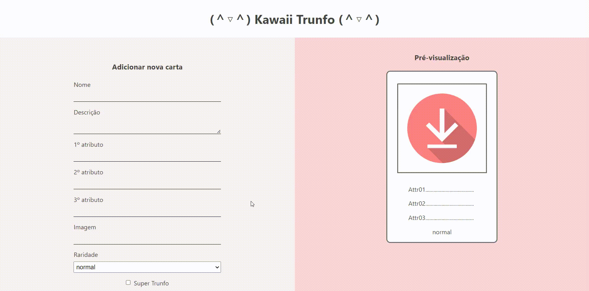

# Kawaii Trunfo (＾▽＾)

Projeto de uma página onde é possível criar cartas de um jogo de _trunfo_, desenvolvido durante o curso de Desenvolvimento Web Full Stack da [Trybe](https://www.betrybe.com/).

A página foi desenvolvida em React, trabalhando conceitos de estado e componentes controlados, e nela é possível adicionar cartas muito **kawaii** ao baralho do jogo de trunfo e excuí-las caso necessário.

Abaixo, é possível ver um gif que mostra o funcionamento da página. É possível acessar o deploy [aqui](https://tainnaps.github.io/kawaii-trunfo/) 🚀



## Tecnologias
As tecnologias utilizadas para o desenvolvimento da aplicação foram:
- React
- JavaScript
- HTML
- CSS

## Executando o projeto
Para executar o projeto, é necessário:

1. Clonar este repositório
  ```
  git clone https://github.com/tainnaps/kawaii-trunfo.git
  ```
2. Instalar as dependências na branch `main`
  ```
  npm install
  ```
3. Iniciar o servidor da aplicação
  ```
  npm start
  ```
4. Acessar `localhost:3000` no navegador
